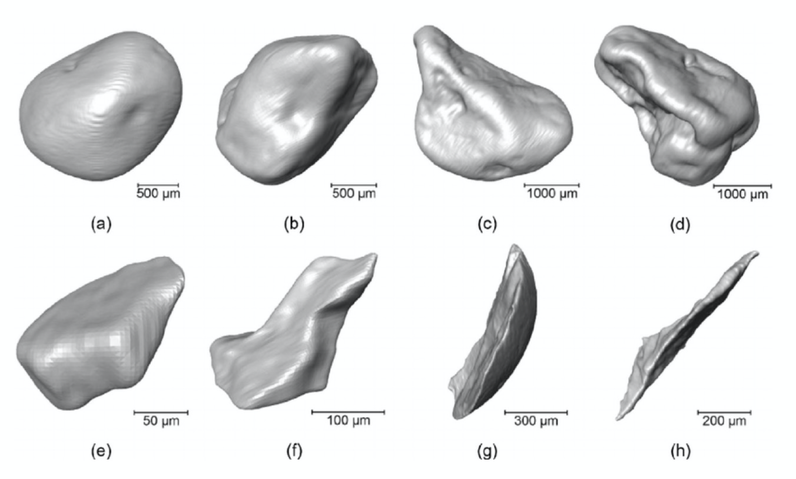
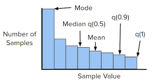
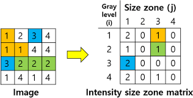
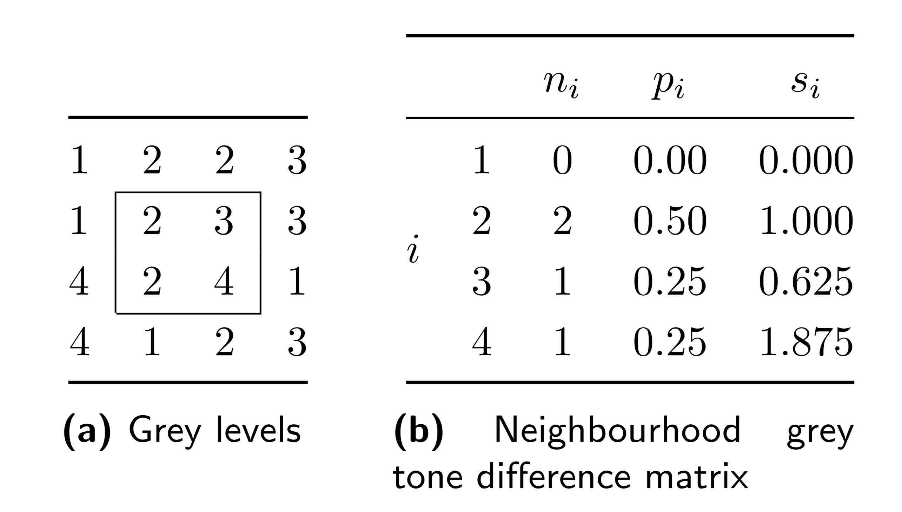
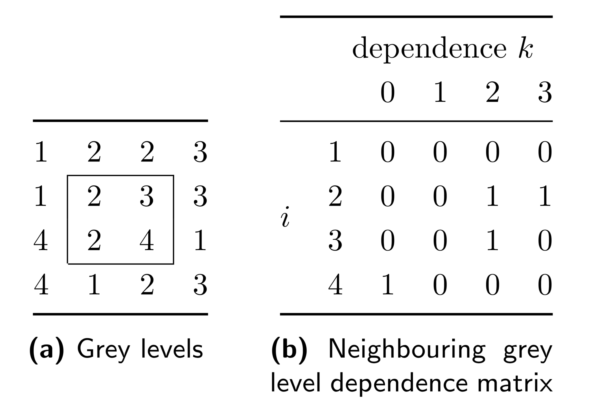

# ESOR Radiomics Workshop

## Overview of the workshop
Duration: 0:05

In this workshop will teach you how to develop radiomics models, where we will explore and learn about each block of the
 radiomics workflow. 
 
In this workshop we will use the PROSTATEx dataset (Joint SPIE-AAPM-NCI challenge - 2017 SPIE Medical Imaging Symposium) 
to learn how to perform all the different steps 
constituting these blocks required for the development of radiomics a model.

The blocks are defined as follows:
* Definition of the research question
* Segmentation of Region-of-Interest 
* Image Pre-pocessing
* Radiomics Feature Extraction
* Deep Features Extraction
* Radiomics+Deep Features Model Development
* Development of automatic segmentation model (bonus)

The definition of the goal/research question that we will try to solve with radiomics was already defined here by the 
challenge organizers. In this case, the goal of this challenge was to predict clinical significance (biopsy Gleason 
Score of 7 or higher)  of prostate findings. The goals can be on something with the potential to improve the 
patient treatment and outcome, and business efficiency ( image quality, automation of repetitive tasks by radiologists, workflow 
prioritization, etc.). 

Prerequisites:

* Google account (either personal or institutional)

## Segmentation of Region-of-Interest
Duration: 0:10

Segmentation of the lesions/regions-of-interest are important as it allows us to put the focus of feature extracted on 
the particular are were we expect relevant information to be, as well as to obtain morphological information about the 
segmented structure. The segmentation can be done manually, semi-automatically or automatically (it is common that the 
automatic segmentation will not be perfect and will require curation of radiologists - also caused by inter-observer 
variability).
  
Segmentation of regions-of-interest can be done using several tools: 
* <a href="https://www.slicer.org" target="_blank">3D Slicer</a>
* <a href="https://www.mitk.org/wiki/The_Medical_Imaging_Interaction_Toolkit_(MITK)" target="_blank">MITK</a> 
* <a href="http://www.itksnap.org/pmwiki/pmwiki.php" target="_blank">ITK-SNAP</a> 
* <a href="https://www.osirix-viewer.com" target="_blank">OsiriX</a>
* <a href="https://horosproject.org" target="_blank">Horos</a>
* <a href="http://htmlsegmentation.s3.eu-north-1.amazonaws.com/index.html" target="_blank">MedSeg</a>

In this workshop we will use 
<a href="http://htmlsegmentation.s3.eu-north-1.amazonaws.com/index.html" target="_blank">MedSeg</a>, which is a 
web-based solution that does not require you to install any application and works in your browser.

Although prostate MRI is multi-parametric, for simplicity we will use only T2-weighted images. We will perform the 
segmentation of the index lesion in this following examination that you should download to your computer.

To perform the segmentation lets follow these steps:

1. <a href="https://www.dropbox.com/s/t21vfflozy5cpym/T2w_prostate_example.nii.gz?dl=1" target="_blank">Download 
T2-weighted Prostate Image</a>

2. <a href="http://htmlsegmentation.s3.eu-north-1.amazonaws.com/index.html" target="_blank">Open MedSeg on your 
browser</a>

3. Drag the file you just downloaded (T2w_prostate_example.nii.gz) file to the MedSeg tab

4. Segment the index lesion and save the resulting segmentation file

The image and segmentation mask files can either be used to extract radiomics features, as we will see later, or to 
train deep learning models to perform the segmentation automatically.

## Image Pre-processing
Duration: 0:10

A very important part of the whole radiomics model development is the pre-processing of the images to be analyzed. 
Several artifacts (motion, noise, intensities inhomogeneities caused by MRI radio
frequency field inhomogeneities) may affect images.

We will teach you a way to denoise and correct bias field inhomogeneities.

Lets open the following colab notebook and create your own copy of the notebook that you can run.

## Radiomics Feature Extraction
Duration: 0:10

Radiomic features are mathematical descriptors of image intensities and texture initially defined for computer vision 
tasks. In the radiological context, the features are not extracted from the whole image but from the region-of-interest,
 which could be an organ, part of an organ or a lesion. For this reason, to extract radiomic features we are required to
 provide pairs of images-masks. 
 
Several types of radiomic features can be extracted from the images.

These comprise:
* Shape features
* First-order (histogram) features of the original image
* Second-order (texture) features of the original image
* Higher-order features - first- and second-order features of filtered images

#### Shape features

Shape features can capture different VOI shape-related metrics:
* Volume
* Surface Area
* Surface Area to Volume ratio
* Compactness
* Spherical Disproportion
* Elongatiom
* Maximum 3D/2D-slice/2D-AP/2D-RL
* Flatness 
* etc.

These features are only calculated for the original image

#### First-order features

First-order features can capture different histogram-related metrics:
* Energy
* Entropy
* Minimum/Maximum
* 10th/90th-Percentile
* Interquartile Range
* Skewness/Kurtosis
* Standard deviation/Variance
* Mean/Median
* etc.

These features can be calculated from the original and filtered images.

### Texture features

#### Gray Level Co-occurrence Matrix (GLCM) features

*Example of GLCM matrix and feature computation from gray levels*

From this class the following radiomic features:
* Autocorrelation
* Joint Average
* Cluster Prominence / Shade / Tendency
* Contrast
* Correlation
* Difference Average / Entropy / Variance
* Joint Energy / Entropy
* Informational Measure of Correlation
* Inverse Difference Moment / Difference Moment Normalized / Difference (Homogeneity) / Difference Normalized / Variance
* Maximal Correlation Coefficient (MCC)
* Maximum Probability
* Sum Average/Entropy/ of Squares

#### Gray Level Size Zone Matrix (GLSZM) features

*Example of GLSZM matrix computation from gray levels*

From this class the following radiomic features:
* Small / Large Area Emphasis
* Gray Level Non-Uniformity (Normalized)
* Size-Zone Non-Uniformity (Normalized)
* Zone Percentage
* Gray Level Variance
* Zone Variance / Entropy
* Low / High Gray Level Zone Emphasis
* Small Area Low / High Gray Level Emphasis
* Large Area Low / High Gray Level Emphasis

#### Gray Level Run Length Matrix (GLRLM) features

*Example of GLRLM matrix computation from gray levels*

From this class the following radiomic features:
* Short / Long Run Emphasis
* Gray Level Non-Uniformity (Normalized)
* Run Length Non-Uniformity (Normalized)
* Run Percentage
* Gray Level Variance
* Run Variance / Entropy
* Low / High Gray Level Run Emphasis
* Short Run Low / High Gray Level Emphasis
* Long Run Low / High Gray Level Emphasis

<!---
#### Gray Level Run Length Matrix (GLRLM) features

*Example of GLRLM matrix computation from gray levels*

From this class the following radiomic features:
* Short / Long Run Emphasis
* Gray Level Non-Uniformity (Normalized)
* Run Length Non-Uniformity (Normalized)
* Run Percentage
* Gray Level Variance
* Run Variance / Entropy
* Low / High Gray Level Run Emphasis
* Short Run Low / High Gray Level Emphasis
* Long Run Low / High Gray Level Emphasis
-->

#### Neighbouring Gray Tone Difference Matrix (NGTDM) features

*Example of NGTDM matrix computation from gray levels*

From this class the following radiomic features:
* Coarseness
* Contrast
* Busyness
* Complexity
* Strength

#### Gray Level Dependence Matrix (GLDM) features

*Example of GLDM matrix computation from gray levels*

From this class the following radiomic features:
* Small / Large Dependence Emphasis
* Gray Level Non-Uniformity
* Dependence Non-Uniformity (Normalized)
* Gray Level Variance
* Dependence Variance / Entropy
* Low / High Gray Level Emphasis
* Small Dependence Low / High Gray Level Emphasis
* Large Dependence Low / High Gray Level Emphasis

Other feature classes may also be available through other libraries.

First-order and Texture features may also be extracted from filtered images.

The main idea behind the application of filter for the extraction of radiomic features is to emphasize specific transitions/textures/contours/etc.

Examples of filters that can be applied to the original images for feature extraction are:
* Laplacian of Gaussian (LoG)
* Wavelets
* Exponential
* Logarithm
* Square
* Square-Root

In this colab notebook link we illustrate the results of applying each of the filters to the original image.

Depending on the image modality and image acquisition characteristics, several options on the feature extraction may 
vary.

If the voxel intensities have units (e.g., CT - HU; PET - SUV; MRI-ADC - mm2/s, etc.) we can expect some 
degree of standardization of the intensities across patients.
On the other if considering, for example T2w images, the voxel intensities have arbitrary units and normalization may be
needed to standardize the intensities across patients.

Two different approaches for the intensity discretization can be used:
* bin width - each intensity bin will have this predefined width 
* bin count - image intensities are stretched or squeezed so that the intensities within the mask will be divided into 
this predefined number of bins

The resolution of the images will also impact the radiomic feature extraction. If utilizing a dataset that it is 
heterogeneous in terms of voxel spacing, this should also be standardized through resampling so that the meaninng of the
extracted radiomic features can be compared and differences don't reflect solely differences in resolution. Another 
important part of the feature extraction is whether we have isotropic or anisotropic images. Features can be extracted 
both in 2D or 3D, where the later requires the use isotropic images. The transformation of anisotropic images to 
isotropic is possible through resampling but the it requires the downsample of the in-plane resolution (with loss of 
information) or the upsampling of the through-plane resolution (with non-acquired information being considered), or even
a mix both. 

We will make use of PyRadiomics to extract the radiomic features.

So lets open the following colab notebook, create your copy and start running it.

<!---
## Deep Features Extraction
Duration: 0:10

Another way to extract features is to use pre-trained convolutional neural networks (CNN) for visual object recognition 
trained on over 14 million of images comprising 20000 categories (e.g., cat, dog, car, airplane, etc.). The features are
 obtained from the CNN chosen layer. This approach is part of the transfer learning concept.
 
In this example we will use the a pre-trained [add name of chosen CNN] architecture.

So lets open the following colab notebook, create your copy and start running it.

Open Deep Feature Extraction Colab Notebook [add link]

## Radiomics+Deep Features Model Development
Duration: 0:10

After constructing a dataset which you will use to train/evaluate your model

## Development of automatic segmentation model*
Duration: 0:10

After constructing a dataset which you will use to train/evaluate your model
-->

## Radiomics Features Model Development
Duration: TBD

After having extracted the radiomic features for our dataset and having obtained the outcomes for the collected patients
we will develop our model and assess its performance.

The model development and assessment is frequently a part where a lot of mistakes are done that jeopardize the 
performance of the models and that may lead to an apparent correct functioning of our model with possible catastrofic 
results upon model deployment and prediction on new cases.

In the next notebook we will partition our dataset into training and held-out test datasets, using the training dataset 
see how to compare several classifiers, how to train/fine-tune the selected classifier that will constitute our model, 
and, finally, perform its assessment of the developed model with the held-out test dataset.

Lets start! Open the following colab notebook, create your copy and start running it.

